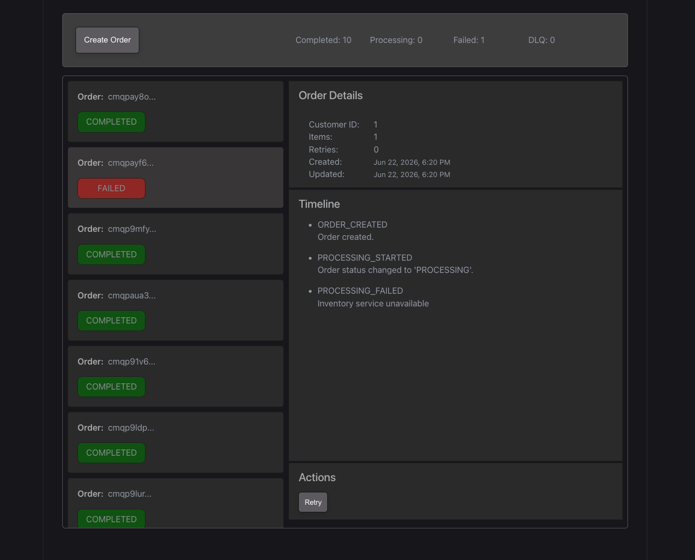

# OrderFlow

OrderFlow is a distributed commerce processing platform built to demonstrate production-grade backend engineering concepts commonly used in modern SaaS and e-commerce systems.

The project focuses on reliability, observability, and operational tooling rather than storefront functionality.

<p align="center">
  
</p>

## Tech Stack

### Backend
- Node.js
- TypeScript
- Fastify
- Prisma
- PostgreSQL
- Redis
- BullMQ

### Frontend
- React
- TypeScript
- Vite

### Infrastructure
- Docker
- Docker Compose

## Implemented Features

### Order Processing
- Order lifecycle management
- State transitions
- Idempotent API operations

### Reliability
- Background job processing
- Retry policies
- Dead-letter queues
- Rate limiting

### Observability
- Audit logs
- Operational metrics
- Real-time order tracking
- Failure visibility

### Administration
- Order dashboard
- Order details timeline
- Retry controls
- Queue monitoring

## Architecture

```text
React UI
    |
    v
Fastify API
    |
    Prisma --> PostgreSQL
            |
             --> Redis
            |
            v
         BullMQ Workers
```

## Local Development

Start all services:

```bash
docker compose up --build
```

Backend health check:

```bash
curl http://localhost:3000/health
```

Frontend:

```text
http://localhost:5173
```

## Project Goals

This project is intended as a portfolio application showcasing:

- Backend architecture
- Distributed systems concepts
- TypeScript development
- API design
- Frontend integration
- Dockerized environments
- Production engineering practices
